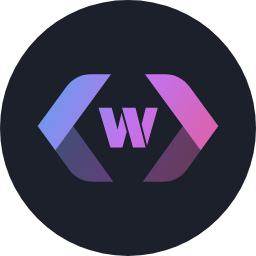
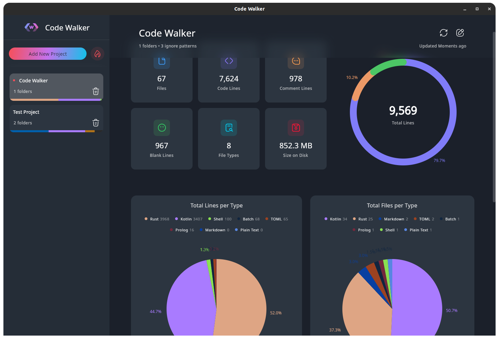

<h1 align="center">CodeWalker</h1>
<h6 align="center">A desktop software for analyzing your source codes and projects, made with compose desktop (taken from <a href="https://github.com/XAMPPRocky/tokei">Tokei</a> library)</h6>

### Screenshot
